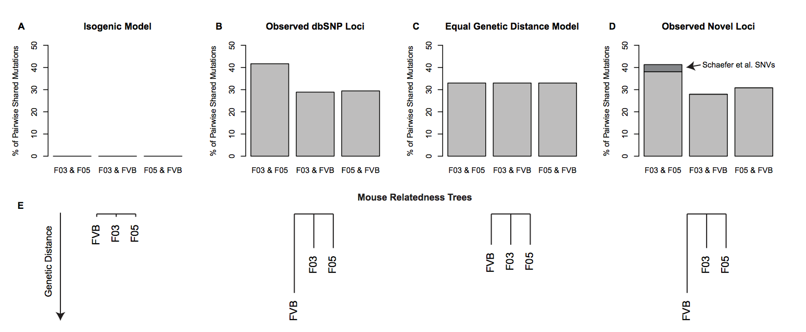

<br><br>

# “Unexpected mutations after CRISPR-Cas9 editing in vivo” are most likely pre-existing sequence variants and not nuclease-induced mutations

This web resource contains the scripts, commands, and most data required for what we
reported in this [bioRxiv preprint](http://www.biorxiv.org/content/early/2017/07/05/159707).

Our re-analysis was conducted by members of the [Aryee](https://aryee.mgh.harvard.edu/),
[Joung](http://www.jounglab.org/), and [Pinello](http://pinellolab.org/) Labs at MGH/Harvard
in response to [this manuscript](https://www.nature.com/nmeth/journal/v14/n6/full/nmeth.4293.html).


## Overview

In brief, we genotype the mice from the WGS data using GATK and replicate the "cancer pipeline"
calls from the original informatic analysis pipeline. A succinct summary how we structured
the sensible assumptions needed to determine if mutations were caused by Cas9 contrasted
with the observed data are contained in our main figure. 



**Figure 1. Measures of genetic relatedness in the F03, F05 and FVB mice.**
Schaefer et al.’s experimental model to examine mutations attributable to Cas9 treatment
relies on the assumption that mice are isogenic, meaning no private mutations are observed
within or shared between mice as depicted in (A). However, after genotyping these mice using
GATK best practices, we observe a significant departure from this model, suggesting that the
F03 and F05 mice are more genetically related at common variants (B; n = 31,079).
As an isogenic system is practically impossible, the selection of littermate assumes the number
of loci with shared genotypes is nearly identical for all mice, leading to equivalent genetic
distances separating them as shown in (C).  This representation of an equal genetic model
demonstrates a clear departure from the observed data at common variants and other non-dbSNP
loci that we term “novel variants” (D; n = 38,981). Additionally, the variants previously
reported by Schaefer et al. (dark gray, D) represent a small subset of the genotypes common
to F03 and F05 but distinct from FVB at non-dbSNP sites. The observed ratios in B and D cannot
be distinguished from each other (p = 0.304; two-sided Fisher’s Exact Test), but each
represent a significant departure (p < 2.2 10-16; Chi-Squared Test) from the equal genetic
distance model (C) required to attribute differential SNVs to Cas9 activity.
Panel (E) provides a graphical summary of these models of genetic relatedness using under
the two hypothetical models and the two sets of observed variants. 

## Data access

Arguably, the most important files for understanding our response manuscript are the raw 
genotype files called from GATK. These can be accessed from an AWS instance as the
files exceed a combined **7 gigabytes**. 

```
wget https://s3.amazonaws.com/crispr-mutation-reanalysis/allSamples.merged.fullData.vcf.gz
wget https://s3.amazonaws.com/crispr-mutation-reanalysis/allSamples.merged.fullData.vcf.gz.tbi
```

Additionally, the full set of loci that we used to annotate whether variants were in dbSNP or not:

```
wget https://s3.amazonaws.com/crispr-mutation-reanalysis/allSNPannotations.bed.gz
```

**Note:** this isn't a `.bed` file _per se_ as it only has two columns, which was
constructed as such to save space. A third column can be added using a simple `awk` command
and adding 1 to the second field (_i.e._: `$2 +1`) and potentially a dummy fourth column
depending on the down-stream analysis tool. 

Finally, **the original authors were gracious enough to provide us with their code and results**,
which we have integrated into our analysis framework and hosted in our
[git repository here](https://github.com/aryeelab/crispr_mutation_reanalysis/tree/master/SNV_reanalysis/original_variant_calls)


## Our analyses

Below is a synopsis of what we did and how one can navigate this web resource to access the files and data. 

### Variant Recalling

The pipeline for recalling variants from the `.fastq` files is found [here](variantCallingPipeline). 
Our reanalysis followed [this protocol](https://www.ncbi.nlm.nih.gov/pmc/articles/PMC4243306/) for
best practices in aligning and prepping whole-genome sequencing samples. 

### File naming conventions

Throughout the repository, most samples in the reanalysis are ID'd
by the last two digits of the `SRR` number. This table is the most useful key--

```
FVB - Control - 98
F03 - Treated - 97
F05 - Treated - 96
```

When doing variant calling, the normal tissue is specified with an `n` and the tumor tissue with a `t`. 
For example, the output file of `n96_t98` would be the 96 sample (F05) is the `n = normal` and
98 sample (Control) is `t = tumor` when doing variant calling. 

## Important

- Install [git large file storage](https://git-lfs.github.com/) before cloning repository
to get some of the larger files in the repository.
- Accessing specific scripts and data may be easier using the navigation tools on the 
main [GitHub Repository here](https://github.com/aryeelab/crispr_mutation_reanalysis).

## Contact

- If something's missing or doesn't make sense, feel free to shoot [Caleb](mailto:caleblareau@g.harvard.edu)
an email.
- For general questions regarding the manuscript, email one of the corresponding authors. 

<br><br>
